## Introduction

The objective of this report is to explore possibilities of improving the quality of recognising pellet types. The main focus will be to use existing OCR solutions in order to extract text from the images, and then to match extracted text with some existing pellet label.

## Attention-based OCR

[https://github.com/emedvedev/attention-ocr](https://github.com/emedvedev/attention-ocr) built on the top of [https://github.com/da03/Attention-OCR](https://github.com/da03/Attention-OCR) 

### Description

Model architecture:

“The model first runs a sliding CNN on the image (images are resized to height 32 while preserving aspect ratio). Then an LSTM is stacked on top of the CNN. Finally, an attention model is used as a decoder for producing the final outputs.”

### Pretrained model

[https://github.com/da03/Attention-OCR](https://github.com/da03/Attention-OCR) contains a link to a pretrained checkpoint, however the model is not compatible with TensorFlow newer than 1.3. After introducing changes to fix that (the ones suggested in[ https://github.com/da03/Attention-OCR/issues/71#issuecomment-565339256](https://github.com/da03/Attention-OCR/issues/71#issuecomment-565339256)) the checkpoint files didn’t load. So its performance couldn’t be tested.

### Dataset

Synth dataset is recommended for training:

[https://www.robots.ox.ac.uk/~vgg/data/text/](https://www.robots.ox.ac.uk/~vgg/data/text/)

It consists of 90k pictures (~10 GB) with one word on each picture. Pictures look like this:

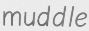

I’ve prepared a script to convert annotations already present in the dataset to the format accepted by the model. [convert_synth_annotations.py](convert_synth_annotations.py)

### Pellets Dataset

[https://github.com/foundationmsf/improc/tree/master/pellet_labels/data](https://github.com/foundationmsf/improc/tree/master/pellet_labels/data)

Zip files contain datasets splitted into train/ and validation/ folders. Each folder contains subfolders. Each subfolder contains images pellets of the same type, and the subfolder’s name is the pellet’s label.

For instance “train/MXF 5/” contains all training images of pellets of the type ‘MXF 5’.

### Training

Model was trained for 20 epochs. Each epoch took ~4h (I used one P100 GPU). All the other training parameters remained unchanged.

### Validation

Results on the validation dataset look good. Most of the words were recognised correctly.

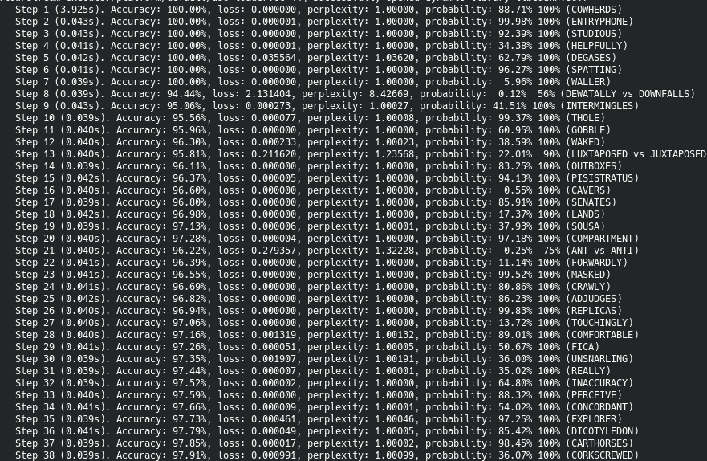

(lines with ‘100%’ are the ones recognised correctly, in the rest you can see, what was 

Some visualizations, how the attention mechanism focuses on particular letters:

Itemizing:

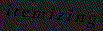

Laurence:

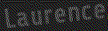

Simper:

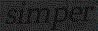

Exterminated:

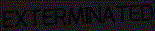

Indeed, the model has finished its training.

### Results

Results on pellet labels don't look good. Detected text looks pretty random.

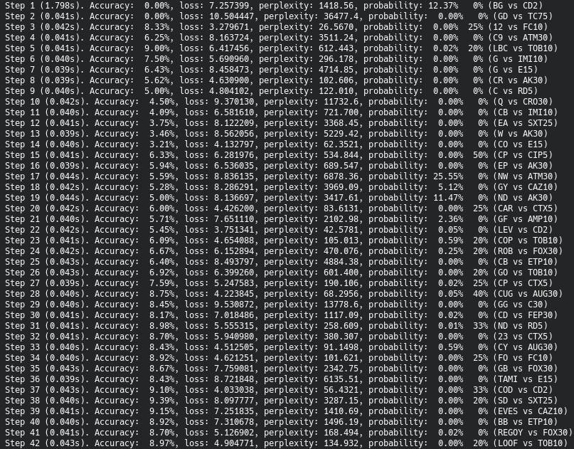

(in the last column there are “RECOGNIZED vs ACTUAL” words)

Visualizations look random too.

Predicted: LOA

Predicted: COD

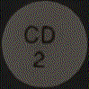

Predicted: SD

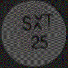

Even though the model is able to recognise images from the validation dataset, it is unable to recognize text written on antibiotic pellets.

### Rotating images

Rotating pellet images didn’t help. Even if the text is perfectly horizontal, the model struggles to recognise it.

Two examples of images rotated every 10 degrees. In some configurations, recognised text doesn’t make sense at all, while in the other it makes some sense, but it is still not possible to classify the pellet based on that.

(helper script to rotate images: [tilt_image.py](tilt_image.py))

Experiments on rotating this pellet:

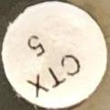

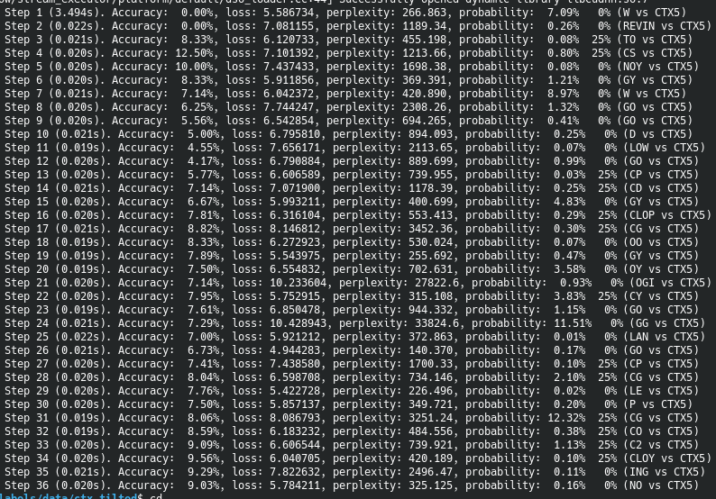

Experiments on rotating this pellet:

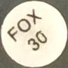

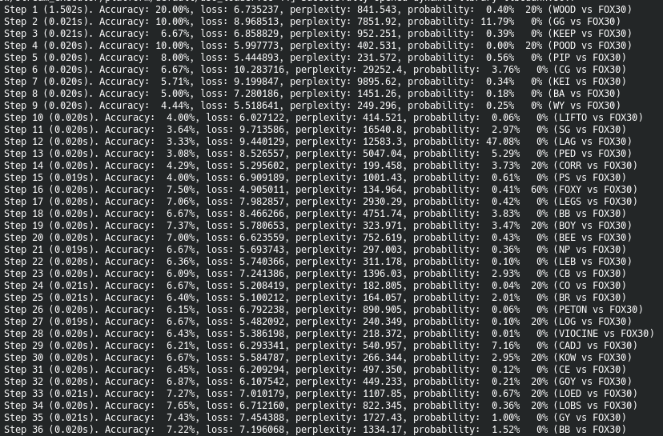

### Summary

**This model cannot be used to recognise pellets**. Possible reasons:

*   At the beginning it resizes pictures to have 32px height, and letters on the pellets become too small to be readable.
*   It is trained on english words, and “learns” english dictionary. So it’s hard for it to read pellet labels, which are a sequence of a few (1-3) random letters and a number.

One idea of improvement is to feed all possible labels, and then measure loss function against all of them and pick ten one with the lowest loss value. And then maybe iterate over all possible tilts of the picture.

## GCP Vision API

[https://cloud.google.com/vision/docs/ocr](https://cloud.google.com/vision/docs/ocr)

### Description

It’s an API, which in response to an image tells what text it detected. To be specific: it outputs a list of strings it was able to recognise.

For instance, for the 

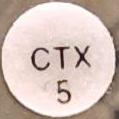

It returns [“CTX”, “5”, “CTX\n5”].

It also returns some other metadata regarding recognised text (i.e. coordinates), but those doesn’t seem to be useful for our application. 

### Prediction algorithm

The main problem is that the pellet labels are not in a single line. Like this

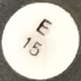

The OCR returns a list of text that it was able to detect. Some of them may contain only the first part on the label, only the second part, or both. Some garbage whitespace (like a new line or additional spaces) can also be added.

To extract the exact label I exploited the fact that the pellet label consists of two parts: few (1-3) capitalized letters and a number. 

1. From each output I filter all letters, and all digits (to eliminate whitespace and everything else).
2. I combine filtered sets of letters and sets of numbers to get some set of “label candidates”.
3. If any of the candidates matches some existing pellet label, then I return it as a resulting class.
4. Try 1-3 with various angles of rotation (every 20 degrees) until the pellet is classified.
5. If at that point I didn’t recognise the pellet, I report the failure.
6. (Idea: if 1-4 fail, it might be useful to try to partially match the label, for instance pick the one that is closest to the candidate in some metric)
7. (Another Idea: Swap similar letters in labels, like O - 0, 1 - l)

### Mistakes

Some characters were recognised incorrectly. For example, when I was playing around, once “85” was recognised as “65”.

For now, both letters sequences are unique, so there would have to be a specific mistake in both parts. And the probability of such an event is low.

Anyway, one strategy to fight that would be to tilt it a few times, and to return the class recognised in the majority of tilts. From the experiments, if some character was recognised incorrectly, then tilting the image might solve that problem (make recognition correct).

### Tool

I developed a tool that uses GCP API, and applies  above heuristics to recognize pellets.

There are to options:

--batch_test FILE - digest a file, where each line has a path to image file and desired label, it should be used to test how well the detection algorithm performs

--detect IMAGE - detects a pellet type on a single picture, for demonstration purposes

Here it is:

[ocr_with_gcloud.py](ocr_with_gcloud.py)

### Results

Using that tool I was able to correctly recognise 6503/6747 pellets (244 not recognised). No pellets were recognised incorrectly. The examples of pellets I couldn’t recognise:

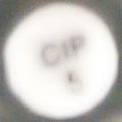

It’s clear that the text is unreadable even for the human's eye. So there is very little we can do with OCRs.

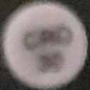

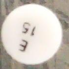

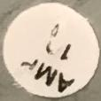

## Attention-based Extraction of Structured Information from Street View Imagery

[https://nanonets.com/blog/attention-ocr-for-text-recogntion/#transformers](https://nanonets.com/blog/attention-ocr-for-text-recogntion/#transformers)

[https://github.com/tensorflow/models/tree/master/research/attention_ocr](https://github.com/tensorflow/models/tree/master/research/attention_ocr)

## Other pellet types

For now the experiments involved only pellets produced by Liofilchem. Here is a list of other manufacturers/brands of pellets, we might want to be able to recognise in a future: [https://docs.google.com/spreadsheets/d/1MLXwUzbTlA0me7SWAhD0ZET-IP06DnYPjtgDTkViFjA/edit#gid=0](https://docs.google.com/spreadsheets/d/1MLXwUzbTlA0me7SWAhD0ZET-IP06DnYPjtgDTkViFjA/edit#gid=0) 
